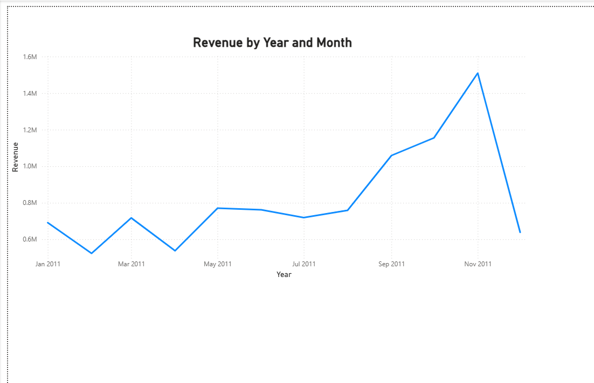
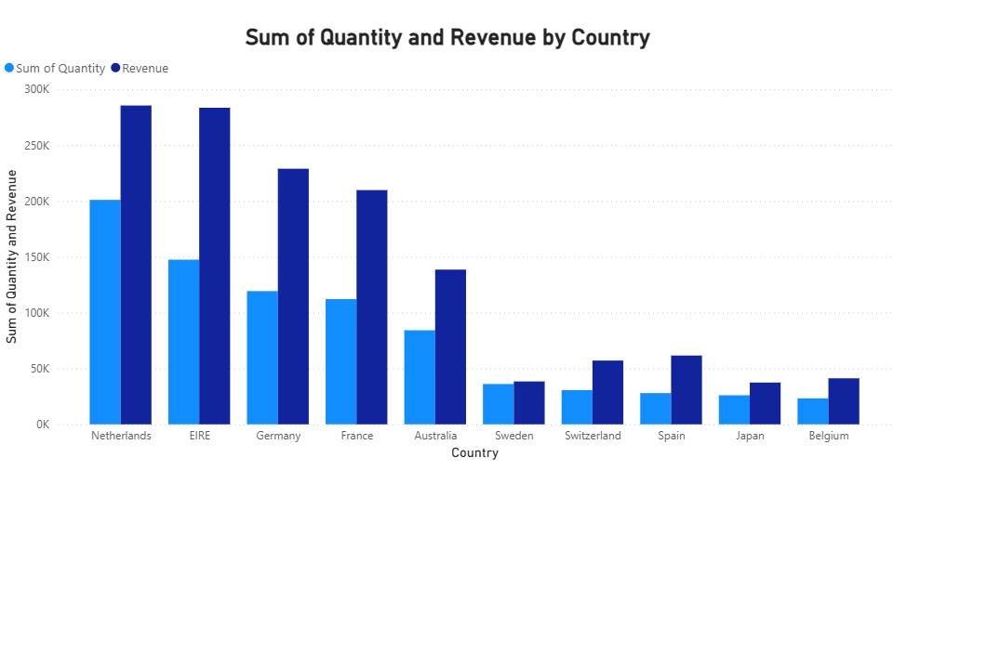
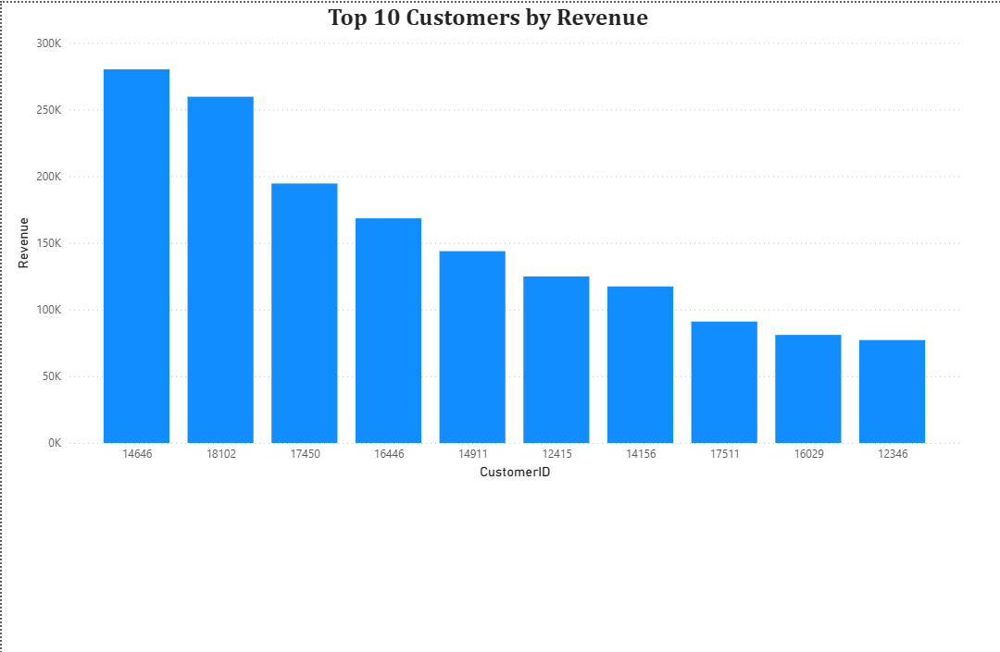
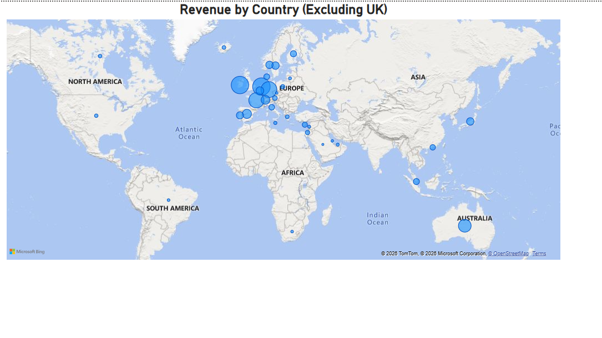

# Deloitte Forage Power BI Online Retail Dashboard

## 📌 Project Overview
This project was completed as part of the **Deloitte Forage Virtual Internship**.  
The goal was to analyze online retail demand and help business leaders identify high-growth regions.

---

## 🎯 Business Questions Answered
1. Which countries show the highest product demand?
2. What are the top revenue-generating customers?
3. How does revenue trend over time?
4. Which regions are best for expansion strategy?

---

## 🧹 Data Cleaning Steps
- Removed blank Customer IDs  
- Filtered out invalid or missing country values  
- Ensured correct data types for Invoice Date  
- Created calculated revenue measure (Quantity × Unit Price)

---

## 📊 Dashboard Pages Preview

### Page 1 – Revenue Trends

### Page 2 – Top Countries by Demand

### Page 3 – Top Customers by Revenue

### Page 4 – Regional Demand Map

---

## 📂 Files Included
- `.pbix` Power BI Dashboard File  
- `.pdf` Export Report  
- `.png` Dashboard Screenshots  
- Dataset used for analysis  

---

## 🚀 Key Insight
The highest demand comes from regions outside the UK, highlighting strong expansion opportunities in Europe and other international markets.

---

### 👤 Created by: Shobha Vishwakarma

